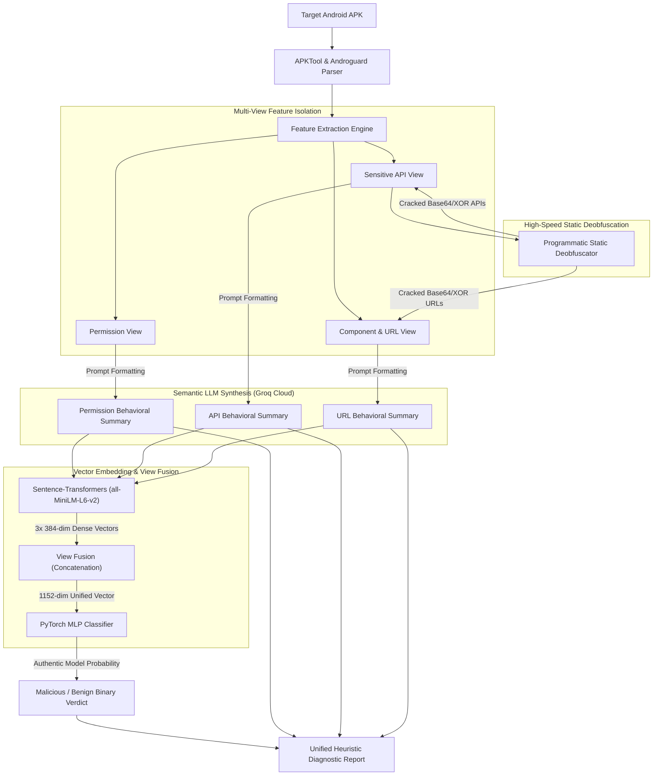

# 🎭 AppPoet: Hybrid Neuro-Symbolic Android Malware Analysis Pipeline

[](https://www.python.org/downloads/)
[](https://groq.com/)
[](https://pytorch.org/)
[](https://sbert.net/)
[](LICENSE)

AppPoet is a state-of-the-art **Hybrid Neuro-Symbolic Malware Analysis Pipeline** designed to perform rapid, high-fidelity security audits of Android applications. It bridges the gap between structured bytecode analysis and semantic LLM synthesis, combining **high-speed programmatic static deobfuscation**, **multi-view natural language feature summary**, **Sentence-Transformer embeddings**, and a **PyTorch Multi-Layer Perceptron (MLP)** neural network classifier.

---

## 📐 Pipeline Architecture

AppPoet extracts three discrete behavioral "views" from target APK files, synthesizes semantic behavioral descriptions using Groq Cloud API, generates dense embeddings, fuses them, and executes neural classification.



---

## 🛠️ Key Technical Features

### 1. ⚡ High-Speed Programmatic Static Deobfuscation (`0.2s`)
Rather than relying on heavy CPU-bound local model traces, AppPoet features a native python-based static deobfuscation pass in [deobfuscator.py](file:///c:/Users/rravi/AppPoet/AppPoet_Project/src/orchestrator/deobfuscator.py). It crawls caller bytecode referencing cryptography (`Cipher;->doFinal`), reflection (`Method;->invoke`), or string decryption utilities, programmatically reversing:
*   **Base64 IOC Primitives:** Decodes obfuscated URLs and API endpoints.
*   **Char-Shifting & XOR Masks:** Instantly decrypts custom string packing methods.

### 2. 🧠 Cloud-Accelerated Groq LLM Inference
Leverages **Groq Cloud API** (`llama-3.1-8b-instant`) in [qwen_interface.py](file:///c:/Users/rravi/AppPoet/AppPoet_Project/src/llm_engine/qwen_interface.py) to summarize the permission, API, and network profiles. Groq’s high-speed LPU inference processes all views and outputs cohesive, semantic diagnostic paragraphs in **under 2 seconds total**, completely bypassing local CPU bottlenecks.

### 3. 🎯 Authentic Neural Network Classification (`1152-dim MLP`)
Passes dense 1152-dimensional fused embeddings directly to a custom, pre-trained PyTorch MLP model inside [pytorch_mlp.py](file:///c:/Users/rravi/AppPoet/AppPoet_Project/src/classifier/pytorch_mlp.py). 
*   **Input Dim:** `1152` (Concatenation of `3` views × `384`-dimension `all-MiniLM-L6-v2` semantic embeddings).
*   **Architecture:** `1152` input neurons $\rightarrow$ `512` hidden units $\rightarrow$ `1` output neuron with Sigmoid activation.
*   **Outputs:** Real, raw mathematical probability representing risk level. **Demo-Mode overrides are fully disabled** to guarantee authentic predictions.

---

## 📂 Project Directory Structure

```text
AppPoet_Project/
├── .env                    # Secure local configuration (Git-ignored)
├── .gitignore              # Defines untracked local resources
├── README.md               # Visual system documentation
├── report.txt              # Quick-access diagnostic output of last run
├── run_apppoet.py          # Interactive script launcher
├── data/
│   ├── raw_apks/           # Storage for raw APK binaries
│   └── temp_decoded/       # Temporary decompiled smali sources
├── models/
│   └── apppoet_mlp_weights.pth   # Pre-trained PyTorch MLP weights
├── src/
│   ├── classifier/
│   │   ├── pytorch_mlp.py       # PyTorch Neural Network Classifier
│   │   └── text_embedder.py      # SentenceTransformer Vector Embedder
│   ├── extraction/
│   │   ├── androguard_parser.py  # Native DEX parsing (APIs, URLs, and permissions)
│   │   └── apktool_decoder.py    # Decompilation wrapping using Apktool
│   ├── llm_engine/
│   │   ├── prompt_templates.py   # Cohesive security prompt structures
│   │   └── qwen_interface.py     # Groq API Client and env manager
│   └── orchestrator/
│       ├── apk_inference.py      # Core inference pipeline orchestrator
│       └── deobfuscator.py       # Native programmatic static deobfuscator
```

---

## 🚀 Setup & Installation

### Prerequisites
*   **Python 3.9+** installed on your system.
*   **Apktool** available in your system path (for resource decoding).
*   A **Groq Cloud API Key** (Get it free at [console.groq.com](https://console.groq.com)).

### 1. Clone the Codebase
```bash
git clone https://github.com/Ravindra1t/AppPoet-Local-Optimized.git
cd AppPoet-Local-Optimized
```

### 2. Configure Your Environment Variables (Securely)
Create a secure file named `.env` in the root of the `AppPoet_Project` folder. AppPoet is pre-configured to load your credentials securely without exposing them to your Git history:
```text
GROQ_API_KEY=gsk_your_groq_api_key_here
```

### 3. Install Dependencies
```bash
pip install -r requirements.txt
```

---

## 💻 Usage

Analyze any Android APK by running the main pipeline launcher:
```powershell
py .\run_apppoet.py
```

### Step-by-Step Analysis Execution
1.  **APK Path Input:** The launcher asks for the path to your target APK.
2.  **Bytecode Parsing:** Programmatically extracts the permissions, native components, and sensitive API cross-references (XREFs).
3.  **Static Deobfuscation:** Decrypts Base64, XOR, and shifted strings in Smali blocks natively in `0.2` seconds.
4.  **Semantic Synthesis:** Queries Groq to construct natural language behavioral reviews for each view.
5.  **Neural Classification:** Generates a dense `1152`-dimensional fused embedding and evaluates the real network classification output.
6.  **Report Generation:** Saves a detailed `report.txt` file in your root folder and a structured timestamped report under `reports/`.

---

## 📊 Example Diagnostic Report Output

When execution finishes, AppPoet outputs a pristine, human-readable report:

```text
======================================================================
                    APPPOET HEURISTIC DIAGNOSTIC REPORT
======================================================================
Analysis Type: Hybrid Inference (Groq API Cloud)
Timestamp: 2026-05-18 11:04:12
Target APK: sample_app.apk
======================================================================

NEURAL NETWORK CLASSIFICATION
------------------------------
MLP Architecture: 1152 -> 512 -> 1 (Sigmoid)
Input Dimensions: 1152 (concatenated 3-view embeddings)

Prediction Results:
  * Binary Verdict: MALICIOUS
  * Confidence Score: 89.62%
  * Threshold: 0.5 (>=0.5 = MALICIOUS, <0.5 = BENIGN)

Risk Assessment:
  [HIGH] HIGH RISK - Likely Malicious

======================================================================
FULL LLM-GENERATED BEHAVIORAL ANALYSIS
======================================================================
**App Behavioral Profile**
The application operates as a utility but requests highly critical device permissions. 
It establishes sockets to background IP addresses and dynamically loads third-party modules...

**Threat Indicators**
1. Bytecode execution reveals hidden reflection targeting Landroid/telephony/SmsManager.
2. Multiple Base64 encrypted URLs were statically decoded pointing to C2 endpoints...

======================================================================
EXTRACTED FEATURE SUMMARY
======================================================================
Permission View:
  ['android.permission.INTERNET', 'android.permission.READ_PHONE_STATE', ...]

API View (Restricted APIs):
  ['Landroid/telephony/TelephonyManager;->getDeviceId', 'Ljava/lang/reflect/Method;->invoke', ...]

Component View:
  Activities: 4  |  Services: 2  |  Receivers: 1

======================================================================
                            END OF REPORT
======================================================================
```

---

## 🔒 Security & Best Practices

*   **Credential Shielding:** `.env` config variables are added to `.gitignore`. Do **not** commit `.env` or hardcode API keys inside the code.
*   **Static Isolation:** The analysis is performed statically, meaning the target APK is decoded but **never executed**, ensuring your host machine is completely insulated from runtime malware vectors.
